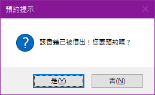
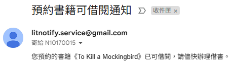

# 明新資工借書系統

## 📌 系統簡介

本系統為「明新科技大學資訊工程系」設計開發的圖書借閱管理工具，提供簡潔直覺的操作介面，協助系上有效管理圖書資源、用戶資訊及借還流程。

線上預約：http://litghostserver.ddns.net:3000

---

## 🖥️ 功能畫面與使用說明

### 🔸 主畫面

提供四大功能選項：
- 借書
- 還書
- 書籍管理
- 用戶管理

---

### 🔸 借書畫面

使用流程：
1. 輸入學號按下 Enter，自動帶出使用者姓名。
2. 輸入書籍編號(條碼)，系統檢查是否可借、是否受年齡限制。
3. 若書籍被借出，使用者可選擇是否預約。
4. 加入借閱清單後，點擊「確定」完成借書。

> 🔔 若使用者年齡未滿 18 歲，系統將限制借閱「限制級」書籍。

---

### 🔔 預約與通知功能

系統支援 **預約借書功能** 與 **可借通知**：

- 使用者若欲借書但該書已被借出，可選擇預約。
- 還書時，若該書已有預約者，系統會自動寄出 Email 通知該用戶。

---

### 🔸 還書畫面

使用流程：
1. 輸入學號，確認使用者。
2. 勾選欲歸還的書籍，按「確定」完成歸還。

---

### 🔸 書籍管理畫面

功能說明：
- 可依書名、作者、編號等條件查詢。
- 勾選後可進行「新增」、「編輯」、「刪除」。

---

### 🔸 書籍編輯畫面

可設定以下書籍欄位：
- 書名
- 作者
- 出版社
- 發行日
- 分級（普通級、限制級）

---

### 🔸 匯入 / 匯出畫面

#### 📥 書籍匯入

- 點擊「匯入」可從 Excel 匯入書籍資料。
- 僅需包含欄位：**書名、作者、出版社、發行日、分級**
- 系統自動為新書接續編號。

#### 📤 書籍匯出

- 匯出當前書籍清單為 Excel 檔案。

#### 📄 匯入格式範本

- 點選「製作範本」可產生一份 Excel 格式參考檔，供日後匯入用。

---

### 🔸 用戶管理畫面

可管理使用者基本資訊：
- 學號
- 姓名
- 生日
- Email（重要：預約通知會寄至此信箱）

---

### 🔸 用戶編輯畫面

填寫基本資料後按下「儲存」即可新增或修改用戶資料。

---

## 📁 資料儲存說明

- 測試階段暫以 JSON 檔案儲存所有資料，如後續有需要可改以資料庫形式儲存。
- 書籍檔案：`books.json`  
- 使用者檔案：`users.json`
- 匯出檔案另存為 Excel 格式（.xlsx）

---

## 🔧 執行環境

- 作業系統：Windows 10
- 開發工具：Visual Studio 2022
- 技術架構：C#（Windows Forms 應用程式）

---

## 📬 聯絡資訊

如有建議或問題，請洽開發團隊成員，謝謝您的使用與支持！