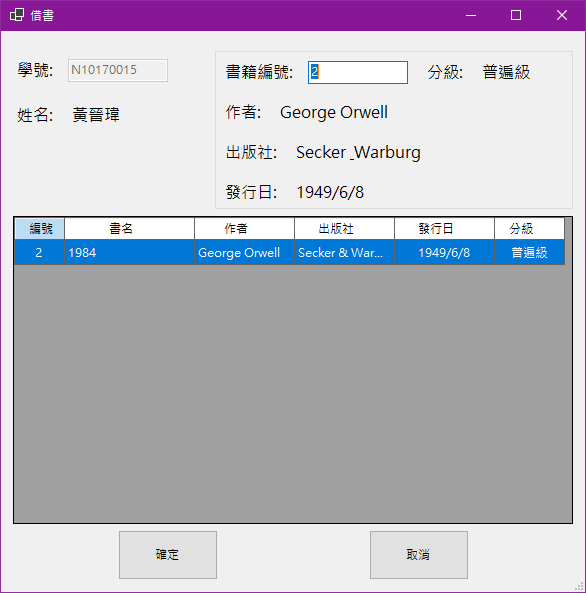
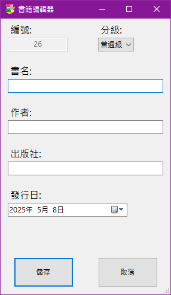

# 明新資工借書系統

## 📌 系統簡介

本系統為「明新科技大學資訊工程系」所設計的圖書借閱管理系統，適用於管理圖書借還、圖書資訊與使用者資料，目標為提供簡潔直覺的使用者介面，提升系上圖書借閱效率與管理便利性。

---

## 🖥️ 功能畫面與使用說明

### 🔸 主畫面

提供四大功能選項：
- 借書
- 還書
- 書籍管理
- 用戶管理  

---

### 🔸 借書畫面

使用流程：
1. 輸入學號後按 Enter，系統會自動帶出使用者姓名。
2. 輸入欲借書籍，加入下方表格。
3. 點擊「確定」完成借書，或點選「取消」放棄操作。

---

### 🔸 還書畫面

使用流程：
1. 輸入學號並確認姓名。
2. 系統列出該使用者所借書籍。
3. 勾選欲歸還的書籍，點擊「確定」完成還書。

---

### 🔸 書籍管理畫面

提供書籍資料的查詢、編輯與管理功能：
- 可依「編號」、「書名」、「作者」等條件查詢。
- 勾選項目後可進行「新增」、「編輯」、「刪除」操作。

---

### 🔸 書籍編輯畫面

使用者可新增或修改書籍資訊，包括：
- 書名、作者、出版社、發行日
- 分級（普通級、限制級…等）

---

### 🔸 用戶管理畫面

提供學生使用者的基本資料管理，包括：
- 學號、姓名、生日、Email
- 可新增、編輯與刪除使用者資料

---

### 🔸 用戶編輯畫面

編輯或新增使用者資訊：
- 輸入基本資料後按下「儲存」完成設定。

---

## 📁 資料儲存說明

所有使用者與書籍資料皆以 JSON 檔案形式儲存，無需資料庫，方便管理與備份。

---

## 🔧 執行環境

- 作業系統：Windows 10
- 開發工具：Visual Studio 2022
- 程式語言：C#（Windows Forms）

---

## 📬 聯絡資訊

如有任何問題或建議，請聯繫專案開發人員。
